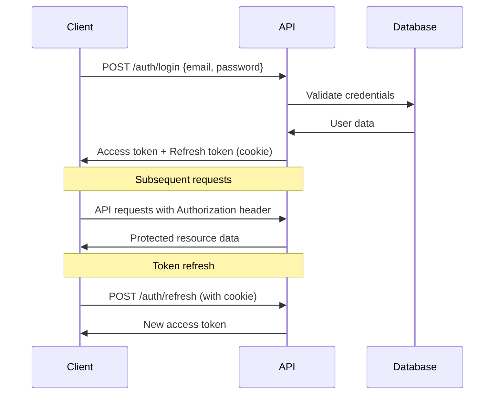
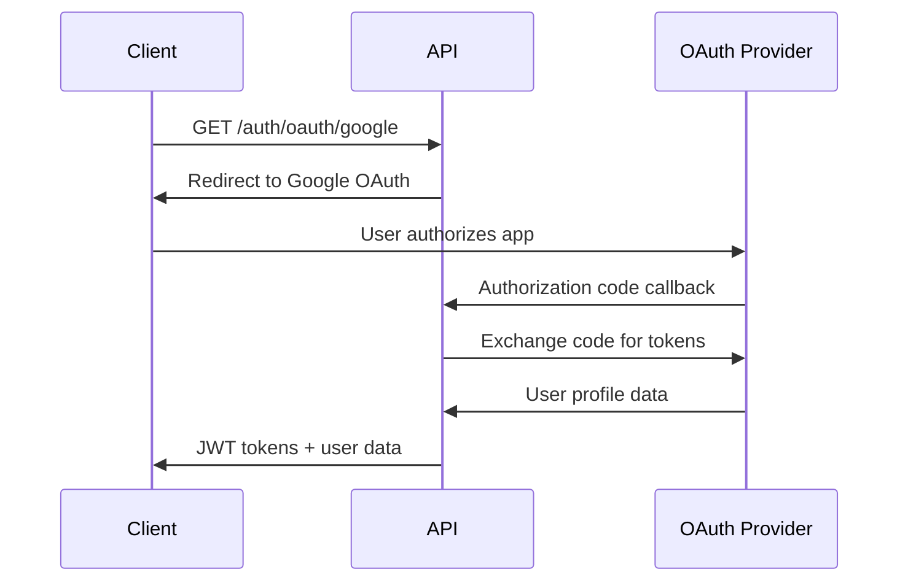
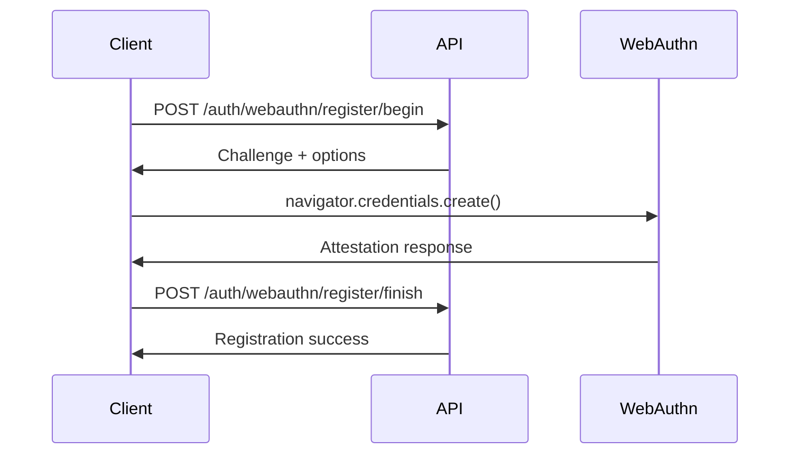

# API Documentation

This document provides a comprehensive overview of the Enterprise Authentication Template API. For interactive API documentation, visit the Swagger UI at `/docs` when the backend is running.

## 📋 Table of Contents

- [Base URL](#base-url)
- [Authentication](#authentication)
- [Response Format](#response-format)
- [Rate Limiting](#rate-limiting)
- [Error Handling](#error-handling)
- [API Endpoints](#api-endpoints)
- [Authentication Flows](#authentication-flows)
- [WebAuthn Integration](#webauthn-integration)
- [Code Examples](#code-examples)

## 🌐 Base URL

```
Development: http://localhost:8000/api/v1
Production:  https://your-domain.com/api/v1
```

## 🔐 Authentication

The API uses JWT (JSON Web Tokens) for authentication with a dual-token approach:

- **Access Token**: Short-lived (15 minutes), used for API requests
- **Refresh Token**: Long-lived (30 days), HTTP-only cookie for token refresh

### Authentication Header

```http
Authorization: Bearer <access_token>
```

### Token Refresh

```http
POST /auth/refresh
Cookie: refresh_token=<refresh_token>
```

## 📝 Response Format

All API responses follow a consistent format:

```json
{
  "success": true,
  "data": {
    // Response data here
  },
  "message": "Operation successful",
  "timestamp": "2024-09-05T12:00:00Z",
  "request_id": "uuid-v4-string"
}
```

### Error Response Format

```json
{
  "success": false,
  "error": {
    "code": "ERROR_CODE",
    "message": "Human-readable error message",
    "details": {
      "field": ["Validation error details"]
    }
  },
  "timestamp": "2024-09-05T12:00:00Z",
  "request_id": "uuid-v4-string"
}
```

## 🚦 Rate Limiting

Rate limits are applied per IP address and authenticated user:

| Endpoint Type | Rate Limit |
|---------------|------------|
| Authentication | 5 requests/minute |
| General API | 100 requests/minute |
| Admin API | 50 requests/minute |
| Password Reset | 3 requests/minute |

Rate limit headers:
```http
X-RateLimit-Limit: 100
X-RateLimit-Remaining: 95
X-RateLimit-Reset: 1694012400
```

## ⚠️ Error Handling

### HTTP Status Codes

| Status Code | Description |
|-------------|-------------|
| 200 | Success |
| 201 | Created |
| 400 | Bad Request |
| 401 | Unauthorized |
| 403 | Forbidden |
| 404 | Not Found |
| 422 | Validation Error |
| 429 | Rate Limit Exceeded |
| 500 | Internal Server Error |

### Common Error Codes

| Error Code | Description |
|------------|-------------|
| `INVALID_CREDENTIALS` | Invalid username/password |
| `TOKEN_EXPIRED` | JWT token has expired |
| `TOKEN_INVALID` | JWT token is malformed |
| `USER_NOT_FOUND` | User doesn't exist |
| `USER_INACTIVE` | User account is disabled |
| `USER_LOCKED` | Account locked due to failed attempts |
| `PERMISSION_DENIED` | Insufficient permissions |
| `VALIDATION_ERROR` | Request data validation failed |
| `RATE_LIMIT_EXCEEDED` | Too many requests |

## 🔑 API Endpoints

### Authentication Endpoints

#### Register User

```http
POST /auth/register
```

**Request Body:**
```json
{
  "email": "user@example.com",
  "password": "SecurePass123!",
  "name": "John Doe",
  "terms_accepted": true
}
```

**Response:**
```json
{
  "success": true,
  "data": {
    "user": {
      "id": "uuid",
      "email": "user@example.com",
      "name": "John Doe",
      "is_active": false,
      "created_at": "2024-09-05T12:00:00Z"
    },
    "message": "Registration successful. Please check your email for verification."
  }
}
```

#### Login

```http
POST /auth/login
```

**Request Body:**
```json
{
  "username": "user@example.com",
  "password": "SecurePass123!",
  "remember_me": false
}
```

**Response:**
```json
{
  "success": true,
  "data": {
    "access_token": "eyJ0eXAiOiJKV1QiLCJhbGciOiJIUzI1NiJ9...",
    "token_type": "bearer",
    "expires_in": 900,
    "user": {
      "id": "uuid",
      "email": "user@example.com",
      "name": "John Doe",
      "roles": ["user"],
      "permissions": ["read:profile"]
    }
  }
}
```

#### Logout

```http
POST /auth/logout
Authorization: Bearer <token>
```

#### Refresh Token

```http
POST /auth/refresh
Cookie: refresh_token=<refresh_token>
```

### OAuth2 Endpoints

#### OAuth2 Login

```http
GET /auth/oauth/{provider}
```

Supported providers: `google`, `github`, `discord`

**Query Parameters:**
- `redirect_uri` (optional): URL to redirect after authentication

#### OAuth2 Callback

```http
GET /auth/oauth/{provider}/callback
```

### Magic Link Authentication

#### Send Magic Link

```http
POST /auth/magic-link
```

**Request Body:**
```json
{
  "email": "user@example.com",
  "redirect_uri": "https://your-app.com/dashboard"
}
```

#### Verify Magic Link

```http
POST /auth/magic-link/verify
```

**Request Body:**
```json
{
  "token": "magic-link-token"
}
```

### Password Management

#### Request Password Reset

```http
POST /auth/password-reset
```

**Request Body:**
```json
{
  "email": "user@example.com"
}
```

#### Reset Password

```http
POST /auth/password-reset/confirm
```

**Request Body:**
```json
{
  "token": "reset-token",
  "new_password": "NewSecurePass123!"
}
```

#### Change Password

```http
POST /auth/password-change
Authorization: Bearer <token>
```

**Request Body:**
```json
{
  "current_password": "CurrentPass123!",
  "new_password": "NewSecurePass123!"
}
```

### User Management

#### Get Current User

```http
GET /users/me
Authorization: Bearer <token>
```

#### Update User Profile

```http
PATCH /users/me
Authorization: Bearer <token>
```

**Request Body:**
```json
{
  "name": "John Smith",
  "phone": "+1-555-0123"
}
```

#### Delete User Account

```http
DELETE /users/me
Authorization: Bearer <token>
```

### Two-Factor Authentication

#### Setup 2FA

```http
POST /auth/2fa/setup
Authorization: Bearer <token>
```

**Response:**
```json
{
  "success": true,
  "data": {
    "qr_code": "data:image/png;base64,iVBOR...",
    "secret": "JBSWY3DPEHPK3PXP",
    "backup_codes": ["123456", "234567", ...]
  }
}
```

#### Verify 2FA Setup

```http
POST /auth/2fa/verify
Authorization: Bearer <token>
```

**Request Body:**
```json
{
  "code": "123456"
}
```

#### Disable 2FA

```http
DELETE /auth/2fa
Authorization: Bearer <token>
```

**Request Body:**
```json
{
  "password": "CurrentPass123!"
}
```

### Session Management

#### List User Sessions

```http
GET /auth/sessions
Authorization: Bearer <token>
```

#### Revoke Session

```http
DELETE /auth/sessions/{session_id}
Authorization: Bearer <token>
```

#### Revoke All Sessions

```http
DELETE /auth/sessions
Authorization: Bearer <token>
```

### Admin Endpoints

#### List Users (Admin Only)

```http
GET /admin/users
Authorization: Bearer <admin_token>
```

**Query Parameters:**
- `page`: Page number (default: 1)
- `per_page`: Items per page (default: 20, max: 100)
- `search`: Search query
- `role`: Filter by role
- `is_active`: Filter by active status

#### Get User by ID (Admin Only)

```http
GET /admin/users/{user_id}
Authorization: Bearer <admin_token>
```

#### Update User (Admin Only)

```http
PATCH /admin/users/{user_id}
Authorization: Bearer <admin_token>
```

**Request Body:**
```json
{
  "is_active": true,
  "roles": ["user", "premium"]
}
```

#### Delete User (Admin Only)

```http
DELETE /admin/users/{user_id}
Authorization: Bearer <admin_token>
```

### Role Management

#### List Roles

```http
GET /admin/roles
Authorization: Bearer <admin_token>
```

#### Create Role

```http
POST /admin/roles
Authorization: Bearer <admin_token>
```

**Request Body:**
```json
{
  "name": "premium_user",
  "display_name": "Premium User",
  "description": "Premium subscription user",
  "permissions": ["read:premium_content", "write:reviews"]
}
```

#### Update Role

```http
PATCH /admin/roles/{role_id}
Authorization: Bearer <admin_token>
```

#### Delete Role

```http
DELETE /admin/roles/{role_id}
Authorization: Bearer <admin_token>
```

### Audit Logs

#### List Audit Logs (Admin Only)

```http
GET /admin/audit-logs
Authorization: Bearer <admin_token>
```

**Query Parameters:**
- `user_id`: Filter by user
- `action`: Filter by action type
- `start_date`: Start date filter
- `end_date`: End date filter
- `page`: Page number
- `per_page`: Items per page

## 🔐 Authentication Flows

### Standard Email/Password Flow



### OAuth2 Flow



### WebAuthn Registration Flow



## 🔑 WebAuthn Integration

### Register WebAuthn Credential

#### Begin Registration

```http
POST /auth/webauthn/register/begin
Authorization: Bearer <token>
```

**Request Body:**
```json
{
  "username": "user@example.com"
}
```

**Response:**
```json
{
  "success": true,
  "data": {
    "challenge": "base64-challenge",
    "rp": {
      "name": "Enterprise Auth",
      "id": "localhost"
    },
    "user": {
      "id": "base64-user-id",
      "name": "user@example.com",
      "displayName": "John Doe"
    },
    "pubKeyCredParams": [...],
    "timeout": 60000
  }
}
```

#### Finish Registration

```http
POST /auth/webauthn/register/finish
Authorization: Bearer <token>
```

**Request Body:**
```json
{
  "id": "credential-id",
  "rawId": "base64-raw-id",
  "response": {
    "attestationObject": "base64-attestation",
    "clientDataJSON": "base64-client-data"
  },
  "type": "public-key"
}
```

### WebAuthn Authentication

#### Begin Authentication

```http
POST /auth/webauthn/authenticate/begin
```

**Request Body:**
```json
{
  "username": "user@example.com"
}
```

#### Finish Authentication

```http
POST /auth/webauthn/authenticate/finish
```

**Request Body:**
```json
{
  "id": "credential-id",
  "rawId": "base64-raw-id",
  "response": {
    "authenticatorData": "base64-auth-data",
    "clientDataJSON": "base64-client-data",
    "signature": "base64-signature"
  },
  "type": "public-key"
}
```

## 💻 Code Examples

### JavaScript/TypeScript

#### Login with Email/Password

```typescript
interface LoginCredentials {
  username: string;
  password: string;
  remember_me?: boolean;
}

interface LoginResponse {
  success: boolean;
  data: {
    access_token: string;
    token_type: string;
    expires_in: number;
    user: User;
  };
}

async function login(credentials: LoginCredentials): Promise<LoginResponse> {
  const response = await fetch('/api/v1/auth/login', {
    method: 'POST',
    headers: {
      'Content-Type': 'application/json',
    },
    body: JSON.stringify(credentials),
    credentials: 'include', // Important for refresh token cookie
  });

  if (!response.ok) {
    throw new Error(`Login failed: ${response.statusText}`);
  }

  return await response.json();
}
```

#### Making Authenticated Requests

```typescript
class ApiClient {
  private accessToken: string | null = null;

  setAccessToken(token: string) {
    this.accessToken = token;
  }

  async request<T>(endpoint: string, options: RequestInit = {}): Promise<T> {
    const url = `/api/v1${endpoint}`;
    const headers = {
      'Content-Type': 'application/json',
      ...options.headers,
    };

    if (this.accessToken) {
      headers.Authorization = `Bearer ${this.accessToken}`;
    }

    const response = await fetch(url, {
      ...options,
      headers,
      credentials: 'include',
    });

    if (response.status === 401) {
      // Try to refresh token
      await this.refreshToken();
      // Retry original request
      return this.request(endpoint, options);
    }

    if (!response.ok) {
      throw new Error(`API request failed: ${response.statusText}`);
    }

    return await response.json();
  }

  private async refreshToken() {
    const response = await fetch('/api/v1/auth/refresh', {
      method: 'POST',
      credentials: 'include',
    });

    if (response.ok) {
      const data = await response.json();
      this.setAccessToken(data.data.access_token);
    } else {
      // Redirect to login
      window.location.href = '/login';
    }
  }
}
```

### Python

#### Using requests library

```python
import requests
from typing import Optional, Dict, Any

class AuthClient:
    def __init__(self, base_url: str = "http://localhost:8000/api/v1"):
        self.base_url = base_url
        self.access_token: Optional[str] = None
        self.session = requests.Session()
    
    def login(self, username: str, password: str) -> Dict[str, Any]:
        """Login and store access token."""
        response = self.session.post(
            f"{self.base_url}/auth/login",
            json={
                "username": username,
                "password": password
            }
        )
        response.raise_for_status()
        
        data = response.json()
        self.access_token = data["data"]["access_token"]
        return data
    
    def get_user_profile(self) -> Dict[str, Any]:
        """Get current user profile."""
        headers = {"Authorization": f"Bearer {self.access_token}"}
        response = self.session.get(
            f"{self.base_url}/users/me",
            headers=headers
        )
        response.raise_for_status()
        return response.json()

# Usage example
client = AuthClient()
client.login("user@example.com", "password123")
profile = client.get_user_profile()
print(profile)
```

### cURL Examples

#### Register a new user

```bash
curl -X POST "http://localhost:8000/api/v1/auth/register" \
  -H "Content-Type: application/json" \
  -d '{
    "email": "newuser@example.com",
    "password": "SecurePass123!",
    "name": "New User",
    "terms_accepted": true
  }'
```

#### Login

```bash
curl -X POST "http://localhost:8000/api/v1/auth/login" \
  -H "Content-Type: application/json" \
  -c cookies.txt \
  -d '{
    "username": "user@example.com",
    "password": "SecurePass123!"
  }'
```

#### Access protected resource

```bash
# Extract token from login response and use it
TOKEN="your_access_token_here"

curl -X GET "http://localhost:8000/api/v1/users/me" \
  -H "Authorization: Bearer $TOKEN"
```

#### Refresh token

```bash
curl -X POST "http://localhost:8000/api/v1/auth/refresh" \
  -b cookies.txt \
  -c cookies.txt
```

## 📊 Health Checks & Monitoring

### Health Check

```http
GET /health
```

**Response:**
```json
{
  "status": "healthy",
  "timestamp": "2024-09-05T12:00:00Z",
  "version": "1.0.0",
  "checks": {
    "database": "healthy",
    "redis": "healthy",
    "email": "healthy"
  }
}
```

### Metrics (Prometheus Format)

```http
GET /metrics
```

## 📝 OpenAPI Schema

The complete OpenAPI 3.0 schema is available at:
- **JSON Format**: `/openapi.json`
- **Interactive Docs**: `/docs`
- **ReDoc**: `/redoc`

## 🔧 Configuration

### Environment Variables

Key API configuration variables:

```bash
# JWT Configuration
JWT_SECRET_KEY=your-secret-key
JWT_ALGORITHM=HS256
JWT_ACCESS_TOKEN_EXPIRE_MINUTES=15
JWT_REFRESH_TOKEN_EXPIRE_DAYS=30

# Rate Limiting
RATE_LIMIT_ENABLED=true
RATE_LIMIT_STORAGE_URI=redis://localhost:6379/0

# CORS
CORS_ORIGINS=["http://localhost:3000", "https://your-domain.com"]
CORS_ALLOW_CREDENTIALS=true

# OAuth2 Configuration
GOOGLE_CLIENT_ID=your-google-client-id
GOOGLE_CLIENT_SECRET=your-google-client-secret
GITHUB_CLIENT_ID=your-github-client-id
GITHUB_CLIENT_SECRET=your-github-client-secret
```

---

For more detailed examples and advanced usage, visit our [GitHub repository](https://github.com/your-org/enterprise-auth-template) or check the interactive API documentation at `/docs` when running the application.