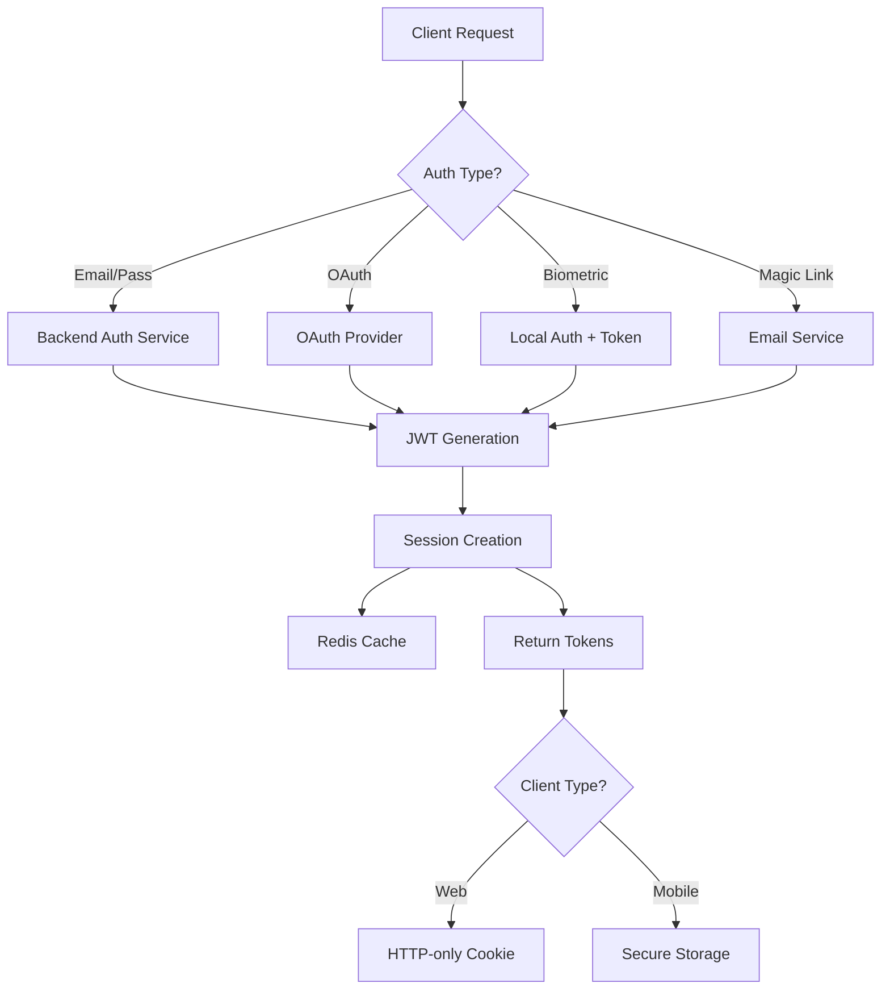

# Enterprise Authentication Template - Clean Architecture

## 🏗️ Architecture Overview

This enterprise authentication template provides a **production-ready, multi-client architecture** with a shared backend that seamlessly supports both web and mobile clients.

### Core Components

```
enterprise-auth-template/
├── backend/                 # FastAPI Backend (Single source of truth)
├── frontend/               # Next.js Web Application
├── flutter_auth_template/  # Flutter Mobile Application
└── infrastructure/         # Docker & Deployment configs
```

## 🎯 Backend Architecture (FastAPI)

### Core Structure
```
backend/
├── app/
│   ├── main.py            # Application entry point
│   ├── api/               # API endpoints
│   │   ├── v1/
│   │   │   ├── auth.py    # Authentication endpoints
│   │   │   ├── users.py   # User management
│   │   │   ├── admin.py   # Admin operations
│   │   │   └── webhooks.py # Webhook management
│   ├── core/              # Core configurations
│   │   ├── config.py      # Settings management
│   │   ├── database.py    # Database connection
│   │   ├── security/      # Security utilities
│   │   └── error_handling.py
│   ├── models/            # SQLAlchemy models
│   │   ├── user.py
│   │   ├── role.py
│   │   ├── organization.py
│   │   └── session.py
│   ├── schemas/           # Pydantic schemas
│   ├── services/          # Business logic
│   │   ├── auth_service.py
│   │   ├── email_service.py
│   │   ├── oauth_service.py
│   │   └── websocket_manager.py
│   ├── middleware/        # Request/Response middleware
│   └── utils/            # Utility functions
├── alembic/              # Database migrations
└── tests/                # Test suite
```

### Key Features
- **Multi-Authentication**: JWT, OAuth2, WebAuthn, Magic Links, 2FA
- **RBAC**: Role-Based Access Control with granular permissions
- **Session Management**: Redis-based session handling
- **Rate Limiting**: Configurable per-endpoint rate limits
- **Audit Logging**: Complete audit trail for compliance
- **WebSocket Support**: Real-time notifications

## 🌐 Frontend Architecture (Next.js)

### Core Structure
```
frontend/
├── src/
│   ├── app/              # Next.js 14 App Router
│   │   ├── (auth)/       # Auth routes
│   │   ├── dashboard/    # Protected routes
│   │   └── api/          # API routes
│   ├── components/       # React components
│   │   ├── auth/         # Auth components
│   │   ├── admin/        # Admin components
│   │   └── common/       # Shared components
│   ├── lib/              # Libraries & utilities
│   │   ├── api/          # API client
│   │   ├── auth/         # Auth utilities
│   │   └── utils/        # Helper functions
│   ├── stores/           # Zustand state management
│   ├── hooks/            # Custom React hooks
│   └── types/            # TypeScript definitions
```

### Key Features
- **Server Components**: Optimized rendering with Next.js 14
- **Type Safety**: Full TypeScript implementation
- **State Management**: Zustand for global state
- **API Integration**: TanStack Query for server state
- **Security**: CSRF protection, secure cookies

## 📱 Mobile Architecture (Flutter)

### Core Structure
```
flutter_auth_template/
├── lib/
│   ├── main.dart         # Application entry
│   ├── app/              # App configuration
│   ├── core/             # Core utilities
│   │   ├── constants/    # API endpoints, themes
│   │   ├── security/     # Biometric, encryption
│   │   └── services/     # Core services
│   ├── data/             # Data layer
│   │   ├── models/       # Data models
│   │   └── services/     # API services
│   ├── domain/           # Business logic
│   ├── presentation/     # UI layer
│   │   ├── pages/        # Screen widgets
│   │   └── widgets/      # Reusable widgets
│   ├── providers/        # State management (Riverpod)
│   └── services/         # Platform services
```

### Key Features
- **Biometric Auth**: Fingerprint/Face ID support
- **Secure Storage**: Encrypted local storage
- **OAuth Integration**: Social login support
- **Offline Mode**: Sync when connected
- **Push Notifications**: FCM integration

## 🔄 Shared Authentication Flow



## 🛡️ Security Architecture

### Authentication Methods
1. **Email/Password**: Bcrypt hashing, password policies
2. **OAuth2**: Google, GitHub, Microsoft integration
3. **WebAuthn**: Passwordless with hardware keys
4. **Magic Links**: Time-limited email links
5. **2FA**: TOTP/SMS verification
6. **Biometric**: Mobile-specific (iOS/Android)

### Security Layers
- **Transport**: HTTPS enforced, HSTS headers
- **Application**: CSRF protection, XSS prevention
- **Data**: Encryption at rest, secure key management
- **Session**: Secure cookies, token rotation
- **Rate Limiting**: Per-IP and per-user limits

## 📊 Database Schema

### Core Tables
- **users**: User accounts with profile data
- **roles**: RBAC role definitions
- **permissions**: Granular permission system
- **organizations**: Multi-tenancy support
- **sessions**: Active user sessions
- **audit_logs**: Compliance audit trail

## 🚀 Deployment Architecture

### Development
```bash
docker-compose -f docker-compose.dev.yml up
```

### Production
```yaml
services:
  backend:
    - FastAPI with Gunicorn
    - Auto-scaling enabled
    - Health checks

  frontend:
    - Next.js with PM2
    - CDN integration
    - Static optimization

  infrastructure:
    - PostgreSQL (Primary DB)
    - Redis (Cache & Sessions)
    - Nginx (Reverse Proxy)
```

## 📝 Core API Endpoints

### Authentication
- `POST /api/auth/register` - User registration
- `POST /api/auth/login` - User login
- `POST /api/auth/logout` - User logout
- `POST /api/auth/refresh` - Token refresh
- `POST /api/auth/verify-email` - Email verification

### User Management
- `GET /api/users/profile` - Get user profile
- `PUT /api/users/profile` - Update profile
- `POST /api/users/change-password` - Change password
- `DELETE /api/users/account` - Delete account

### Admin Operations
- `GET /api/admin/users` - List all users
- `POST /api/admin/roles` - Create role
- `GET /api/admin/audit-logs` - View audit logs

## 🔧 Configuration Files

### Essential Config
- `.env.example` - Environment template
- `docker-compose.yml` - Container orchestration
- `Makefile` - Build automation
- `alembic.ini` - Database migrations

## 🧹 Cleanup Notes

All test files, temporary scripts, and development artifacts have been moved to `_cleanup/` folder for review:
- Test scripts and data
- SQL fix scripts
- Security validation scripts
- Implementation documentation

## 📚 Documentation

### Core Documentation
- `README.md` - Quick start guide
- `ARCHITECTURE.md` - Detailed architecture
- `API_DOCUMENTATION.md` - API reference
- `DEPLOYMENT.md` - Deployment guide
- `SECURITY.md` - Security guidelines

## 🎯 Usage as Template

This template is designed to be:
1. **Cloned** - Start with complete auth system
2. **Customized** - Modify for specific needs
3. **Extended** - Add business logic on top
4. **Deployed** - Production-ready from day one

### Quick Start
```bash
# Clone template
git clone <repo> my-project

# Setup environment
cd my-project
make setup

# Start development
make dev-up

# Access services
- Backend: http://localhost:8000
- Frontend: http://localhost:3000
- Mobile: Run in simulator/device
```

## ✅ What's Built-In

### Backend
✅ Complete authentication system (6 methods)
✅ Role-based access control
✅ Session management with Redis
✅ Email service integration
✅ WebSocket support
✅ Rate limiting
✅ Audit logging
✅ Database migrations
✅ Comprehensive test suite

### Frontend (Web)
✅ Complete auth UI components
✅ Dashboard layouts
✅ Admin panels
✅ User profile management
✅ API integration layer
✅ State management
✅ TypeScript throughout

### Mobile (Flutter)
✅ Complete auth screens
✅ Biometric authentication
✅ Secure storage
✅ API service layer
✅ State management (Riverpod)
✅ Offline support ready
✅ Push notification structure

### Infrastructure
✅ Docker development environment
✅ Production configurations
✅ CI/CD pipelines
✅ Monitoring setup
✅ Security configurations

## 🚀 Next Steps

1. **Review** the `_cleanup/` folder and delete unnecessary files
2. **Configure** your environment variables
3. **Customize** branding and UI themes
4. **Add** your business logic
5. **Deploy** to your infrastructure

This template saves weeks of authentication development time and provides enterprise-grade security from the start!