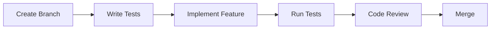

# Developer Onboarding Guide

## Welcome to the Enterprise Authentication Template! 🚀

This guide will help you get up and running with our Flutter authentication template quickly and efficiently.

## Table of Contents
1. [Prerequisites](#prerequisites)
2. [Initial Setup](#initial-setup)
3. [Project Structure](#project-structure)
4. [Development Workflow](#development-workflow)
5. [Key Concepts](#key-concepts)
6. [Common Tasks](#common-tasks)
7. [Testing](#testing)
8. [Debugging Tips](#debugging-tips)
9. [Best Practices](#best-practices)
10. [Resources](#resources)

## Prerequisites

### Required Software
- **Flutter**: 3.9.0 or higher
  ```bash
  flutter --version  # Check your version
  flutter upgrade    # Update if needed
  ```
- **Dart**: 3.0.0 or higher (comes with Flutter)
- **IDE**: VS Code or Android Studio with Flutter plugins
- **Git**: For version control
- **Platform Tools**:
  - Xcode (for iOS development on macOS)
  - Android Studio (for Android development)

### Recommended VS Code Extensions
- Flutter
- Dart
- Bloc
- Error Lens
- Better Comments
- GitLens
- Flutter Riverpod Snippets

## Initial Setup

### 1. Clone the Repository
```bash
git clone <repository-url>
cd flutter_auth_template
```

### 2. Install Dependencies
```bash
flutter pub get
```

### 3. Generate Code
```bash
flutter pub run build_runner build --delete-conflicting-outputs
```

### 4. Configure Environment
Create `.env` file in the project root:
```env
API_BASE_URL=http://localhost:8000
API_TIMEOUT=30000
ENABLE_LOGGING=true
```

### 5. Run the Application
```bash
# Development mode
flutter run

# With specific device
flutter run -d chrome  # Web
flutter run -d ios     # iOS Simulator
flutter run -d android # Android Emulator
```

## Project Structure

### Overview
```
flutter_auth_template/
├── lib/
│   ├── domain/         # Business logic (Clean Architecture)
│   ├── data/           # Data layer implementations
│   ├── infrastructure/ # External services & frameworks
│   ├── presentation/   # UI layer
│   ├── core/           # Shared utilities
│   └── app/            # App configuration
├── test/               # Test files
├── assets/             # Images, fonts, etc.
└── docs/               # Documentation
```

### Key Directories Explained

#### Domain Layer (`lib/domain/`)
- **Purpose**: Core business logic, independent of frameworks
- **Key Files**:
  - `entities/`: Business objects (User, AuthState)
  - `repositories/`: Abstract interfaces
  - `use_cases/`: Business operations

#### Data Layer (`lib/data/`)
- **Purpose**: Implements domain interfaces
- **Key Files**:
  - `models/`: DTOs for API communication
  - `repositories/`: Concrete implementations
  - `datasources/`: API and local data sources

#### Presentation Layer (`lib/presentation/`)
- **Purpose**: UI and state management
- **Key Files**:
  - `pages/`: Screen widgets
  - `widgets/`: Reusable components
  - `providers/`: Riverpod state management

## Development Workflow

### 1. Feature Development Flow


### 2. Adding a New Feature

#### Step 1: Define Domain
```dart
// lib/domain/entities/feature.dart
class Feature {
  final String id;
  final String name;
  // ...
}

// lib/domain/repositories/feature_repository.dart
abstract class FeatureRepository {
  Future<Feature> getFeature(String id);
}

// lib/domain/use_cases/get_feature_use_case.dart
class GetFeatureUseCase {
  final FeatureRepository repository;

  Future<Feature> execute(String id) {
    return repository.getFeature(id);
  }
}
```

#### Step 2: Implement Data Layer
```dart
// lib/data/models/feature_model.dart
class FeatureModel {
  // DTO implementation
}

// lib/data/repositories/feature_repository_impl.dart
class FeatureRepositoryImpl implements FeatureRepository {
  @override
  Future<Feature> getFeature(String id) {
    // Implementation
  }
}
```

#### Step 3: Create UI
```dart
// lib/presentation/pages/feature_page.dart
class FeaturePage extends ConsumerWidget {
  @override
  Widget build(BuildContext context, WidgetRef ref) {
    // UI implementation
  }
}
```

### 3. Git Workflow
```bash
# Create feature branch
git checkout -b feature/your-feature-name

# Make changes and commit
git add .
git commit -m "feat: add new feature"

# Push and create PR
git push origin feature/your-feature-name
```

## Key Concepts

### State Management with Riverpod

#### Providers Types
```dart
// Simple Provider
final configProvider = Provider<Config>((ref) => Config());

// State Provider
final counterProvider = StateProvider<int>((ref) => 0);

// State Notifier Provider
final authProvider = StateNotifierProvider<AuthNotifier, AuthState>((ref) {
  return AuthNotifier();
});

// Future Provider
final userProvider = FutureProvider<User>((ref) async {
  return ref.watch(userRepositoryProvider).getCurrentUser();
});
```

#### Using Providers
```dart
// In widgets
class MyWidget extends ConsumerWidget {
  @override
  Widget build(BuildContext context, WidgetRef ref) {
    final authState = ref.watch(authProvider);
    final counter = ref.watch(counterProvider);

    return Text('Counter: $counter');
  }
}

// Modifying state
ref.read(counterProvider.notifier).state++;
```

### Navigation with GoRouter
```dart
// Define routes
final routerProvider = Provider<GoRouter>((ref) {
  return GoRouter(
    routes: [
      GoRoute(
        path: '/',
        builder: (context, state) => HomePage(),
      ),
      GoRoute(
        path: '/profile/:id',
        builder: (context, state) => ProfilePage(
          userId: state.params['id']!,
        ),
      ),
    ],
  );
});

// Navigate
context.go('/profile/123');
context.push('/settings');
context.pop();
```

### Error Handling
```dart
// Using AppException
try {
  final user = await repository.getUser();
} catch (e) {
  final appException = ErrorHandler.handle(e);
  showError(context, appException.userMessage);
}

// Using Result type
final result = await useCase.execute();
result.when(
  success: (data) => handleSuccess(data),
  error: (error) => handleError(error),
);
```

## Common Tasks

### 1. Adding a New API Endpoint
```dart
// 1. Add to API constants
class ApiConstants {
  static const String newEndpoint = '/api/new-endpoint';
}

// 2. Create request/response models
class NewEndpointRequest {
  // ...
}

class NewEndpointResponse {
  // ...
}

// 3. Add to repository
abstract class MyRepository {
  Future<NewEndpointResponse> callNewEndpoint(NewEndpointRequest request);
}

// 4. Implement in repository
class MyRepositoryImpl implements MyRepository {
  @override
  Future<NewEndpointResponse> callNewEndpoint(NewEndpointRequest request) {
    return apiClient.post(ApiConstants.newEndpoint, data: request);
  }
}
```

### 2. Creating a New Screen
```dart
// 1. Create page widget
class NewPage extends ConsumerWidget {
  const NewPage({Key? key}) : super(key: key);

  @override
  Widget build(BuildContext context, WidgetRef ref) {
    return Scaffold(
      appBar: AppBar(title: Text('New Page')),
      body: // Your content
    );
  }
}

// 2. Add route
GoRoute(
  path: '/new-page',
  builder: (context, state) => NewPage(),
),

// 3. Navigate to it
context.push('/new-page');
```

### 3. Handling Forms
```dart
class LoginForm extends ConsumerStatefulWidget {
  @override
  _LoginFormState createState() => _LoginFormState();
}

class _LoginFormState extends ConsumerState<LoginForm> {
  final _formKey = GlobalKey<FormState>();
  final _emailController = TextEditingController();
  final _passwordController = TextEditingController();

  @override
  Widget build(BuildContext context) {
    return Form(
      key: _formKey,
      child: Column(
        children: [
          TextFormField(
            controller: _emailController,
            validator: (value) => EmailValidator.validate(value),
          ),
          TextFormField(
            controller: _passwordController,
            validator: (value) => PasswordValidator.validate(value),
          ),
          ElevatedButton(
            onPressed: _submit,
            child: Text('Login'),
          ),
        ],
      ),
    );
  }

  void _submit() {
    if (_formKey.currentState!.validate()) {
      ref.read(authProvider.notifier).login(
        _emailController.text,
        _passwordController.text,
      );
    }
  }
}
```

## Testing

### Running Tests
```bash
# Run all tests
flutter test

# Run specific test file
flutter test test/unit/auth_test.dart

# Run with coverage
flutter test --coverage

# Run integration tests
flutter test integration_test/
```

### Writing Tests

#### Unit Test Example
```dart
void main() {
  group('LoginUseCase', () {
    late MockAuthRepository mockRepository;
    late LoginUseCase useCase;

    setUp(() {
      mockRepository = MockAuthRepository();
      useCase = LoginUseCase(mockRepository);
    });

    test('should return user when login is successful', () async {
      // Arrange
      when(mockRepository.login(any, any))
          .thenAnswer((_) async => User());

      // Act
      final result = await useCase.execute('email', 'password');

      // Assert
      expect(result.isSuccess, true);
    });
  });
}
```

#### Widget Test Example
```dart
void main() {
  testWidgets('LoginButton displays loading state', (tester) async {
    await tester.pumpWidget(
      ProviderScope(
        child: MaterialApp(
          home: LoginButton(),
        ),
      ),
    );

    await tester.tap(find.byType(ElevatedButton));
    await tester.pump();

    expect(find.byType(CircularProgressIndicator), findsOneWidget);
  });
}
```

## Debugging Tips

### 1. Enable Debug Logging
```dart
// In main.dart
void main() {
  if (kDebugMode) {
    // Enable logging
    Logger.level = Level.debug;
  }
  runApp(MyApp());
}
```

### 2. Use Flutter Inspector
- Open Flutter Inspector in VS Code/Android Studio
- Inspect widget tree
- Check widget properties
- Debug layout issues

### 3. Network Debugging
```dart
// Add logging interceptor
dio.interceptors.add(LogInterceptor(
  requestBody: true,
  responseBody: true,
));
```

### 4. State Debugging
```dart
// Add ProviderObserver
class MyObserver extends ProviderObserver {
  @override
  void didUpdateProvider(
    ProviderBase provider,
    Object? previousValue,
    Object? newValue,
    ProviderContainer container,
  ) {
    print('${provider.name ?? provider.runtimeType} updated');
  }
}

// Use in main.dart
runApp(
  ProviderScope(
    observers: [MyObserver()],
    child: MyApp(),
  ),
);
```

## Best Practices

### 1. Code Style
- Follow Dart style guide
- Use meaningful variable names
- Keep functions small and focused
- Comment complex logic

### 2. Architecture
- Maintain layer separation
- Depend on abstractions, not implementations
- Keep business logic in domain layer
- Use dependency injection

### 3. State Management
- Keep state immutable
- Use appropriate provider types
- Avoid global state
- Dispose resources properly

### 4. Performance
- Use const widgets where possible
- Implement lazy loading for lists
- Cache expensive operations
- Optimize images

### 5. Security
- Never store sensitive data in plain text
- Use secure storage for tokens
- Validate all inputs
- Implement proper error handling

## Resources

### Official Documentation
- [Flutter Documentation](https://flutter.dev/docs)
- [Dart Documentation](https://dart.dev/guides)
- [Riverpod Documentation](https://riverpod.dev)

### Project-Specific
- [Architecture Guide](./ARCHITECTURE.md)
- [API Documentation](./API_DOCS.md)
- [Testing Guide](./TESTING_GUIDE.md)

### Learning Resources
- [Flutter Cookbook](https://flutter.dev/docs/cookbook)
- [Dart Patterns](https://dart.dev/guides/language/patterns)
- [Clean Architecture](https://blog.cleancoder.com/uncle-bob/2012/08/13/the-clean-architecture.html)

### Tools
- [Flutter DevTools](https://flutter.dev/docs/development/tools/devtools)
- [Postman](https://www.postman.com/) - API testing
- [Charles Proxy](https://www.charlesproxy.com/) - Network debugging

## Getting Help

### Internal Resources
- Team Slack: #flutter-dev
- Wiki: [Internal Wiki Link]
- Code Reviews: Create PR and tag team

### External Resources
- Stack Overflow: Tag with `flutter`
- Flutter Community: [Discord](https://discord.gg/flutter)
- GitHub Issues: For bug reports

## Next Steps

1. ✅ Complete environment setup
2. ✅ Run the app successfully
3. 📖 Read the Architecture Guide
4. 🧪 Run and understand existing tests
5. 💻 Make your first contribution
6. 🎉 Ship your first feature!

Welcome to the team! We're excited to have you contributing to this project. 🚀